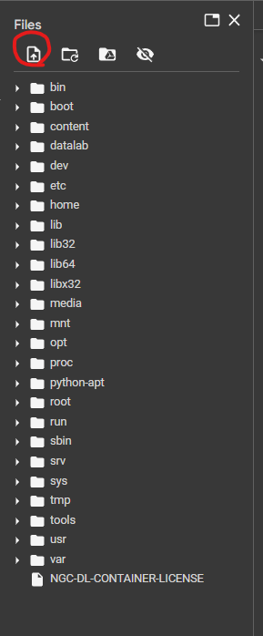

# I310D_FinalProject

## INSTRUCTIONS TO RUN CODE
- First, download the source dataset from this link (will download as excel file): https://www.kaggle.com/datasets/yeanzc/telco-customer-churn-ibm-dataset
- Next, click on the file titled "I310D_FinalProject.ipynb" and click on the button that says "Open in Collab"

- Once in the Google Collaboratory, click on the button with the bullet points to open the Files section
- Next, add the source dataset by clicking on the files button (picture below)

- After that, click on the Runtime button on the top left and click the "Run All" button
- All of the code in the Notebook should run properly!
## Troubleshooting
- If the "Bad magic number" error occurs, first delete the old xlsx file then reupload the source data file as a csv file
- Then, comment out the read_excel line and uncomment the read_csv line in the first block of code
- After that, click the "Run All" button and the problem should be fixed!

